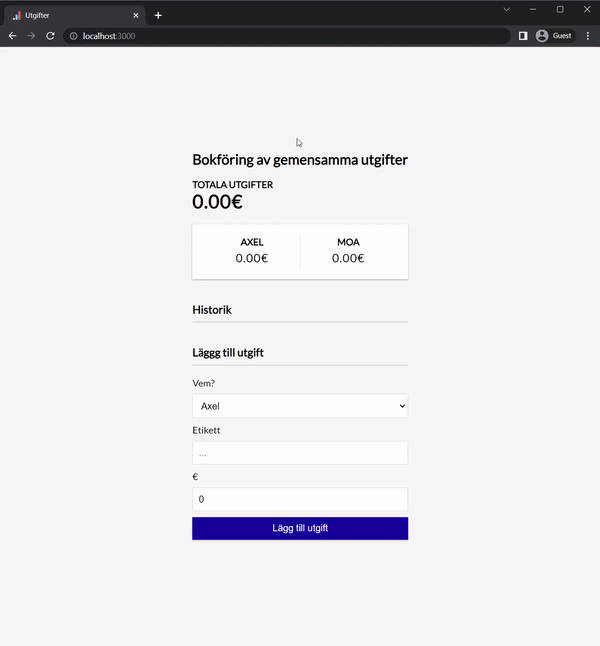

# Expenses
React based web app for me and my girlfriend to keep track of our shared expenses. 



## Build Instructions (Demo)
In the terminal, navigate to the project root directory and execute the following commands:

```
npm install
npm run start
```

The app should now be available at http://localhost:3000.